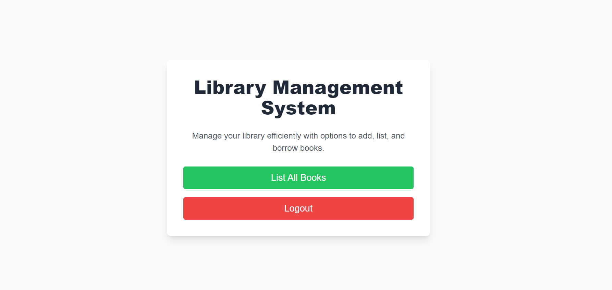
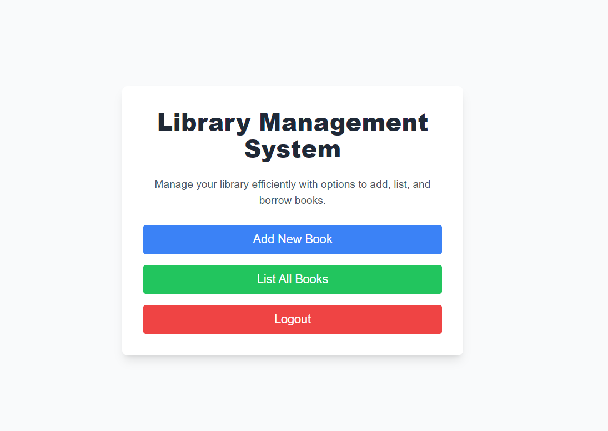
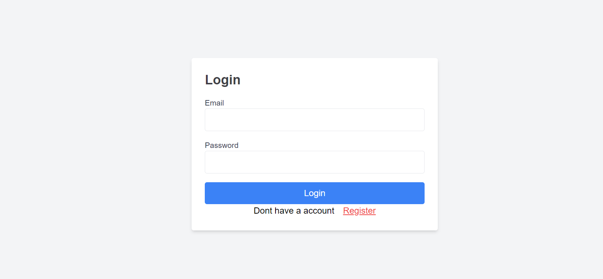
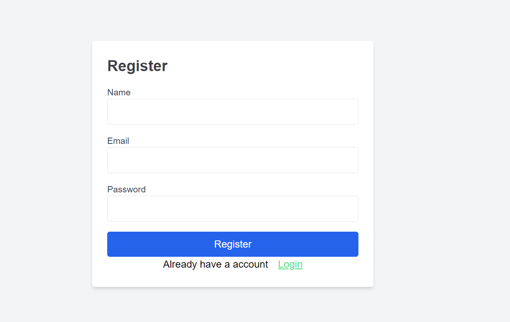
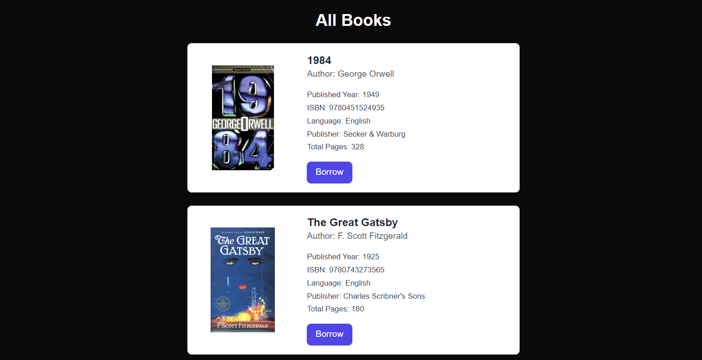
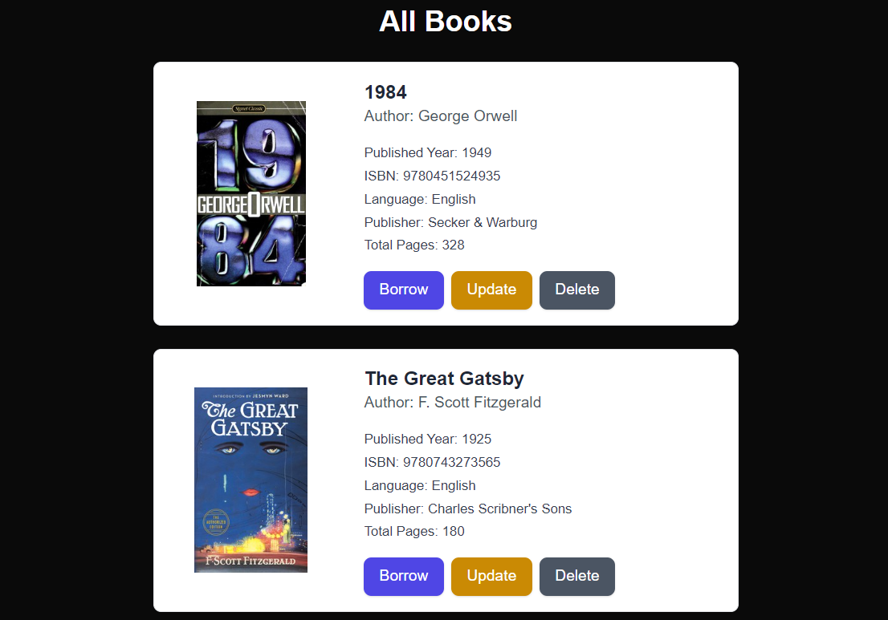
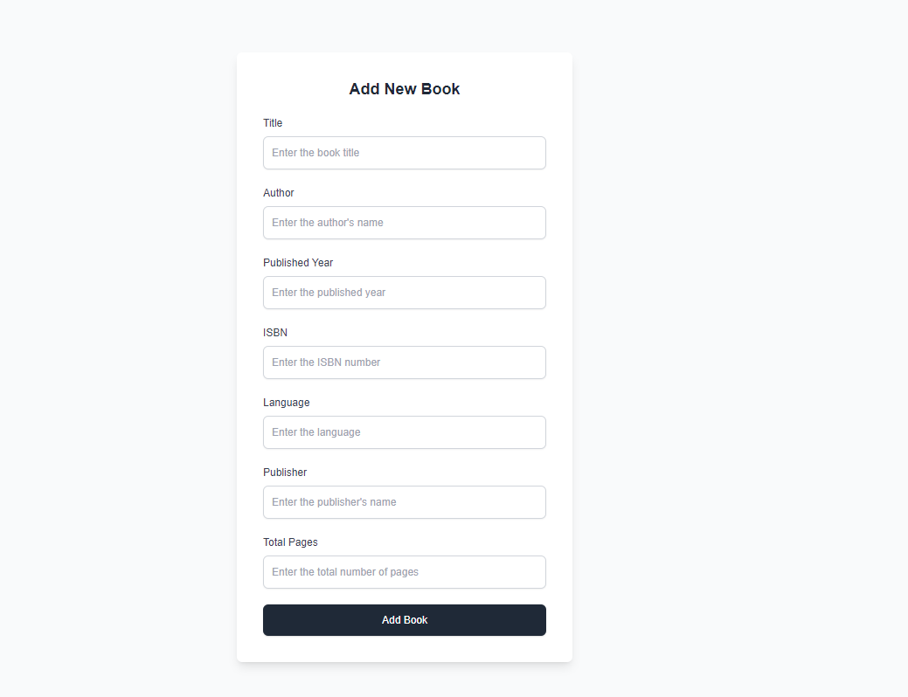
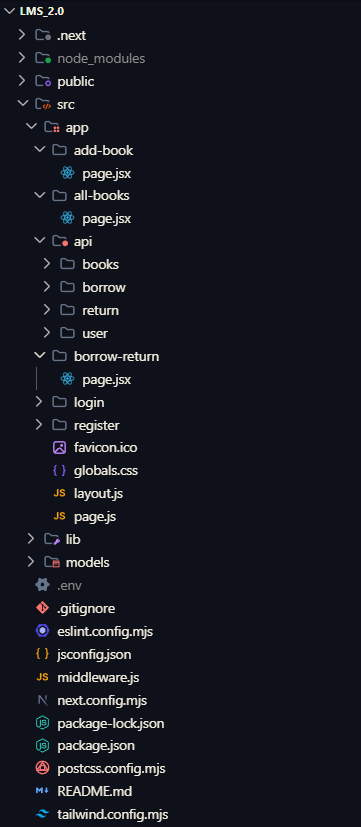

# Library Management System


---

## Table of Contents

- [Features](#features)
- [Demo](#demo)
- [Technologies Used](#technologies-used)
- [Getting Started](#getting-started)
  - [Prerequisites](#prerequisites)
  - [Installation](#installation)
  - [Running the Application](#running-the-application)
- [Folder Structure](#folder-structure)
- [Environment Variables](#environment-variables)
- [Deployment](#deployment)
- [Contact](#contact)

---

## Features

This Library Management System is a full-stack web application designed to manage books, users, and borrowing/returning activities in a library. Below are the key features:

### Frontend Features
- **Add New Books**: Intuitive form to add books with details like title, author, publication year,ISBN,language,publisher,isborrowed and total pages.
- **List All Books**: Paginated list of all books.
- **Borrow and Return Books**: 
  - Normal users can borrow or return books through an easy-to-use interface.
  - Real-time updates to availability status after transactions.
- **Responsive Design**: User-friendly interface built using modern frontend frameworks like React or Vue.js.

### Backend Features
- **Comprehensive API**:
  - **CRUD Operations on Books**: Add, update, delete book details.
  - **User Management**: APIs to create and manage user profiles.
  - **Borrow and Return Books**: Endpoints to handle book transactions.
- **Secure Access**:
  - Authentication and authorization for admin and normal users.
  - Role-based permissions to restrict admin functionalities (e.g., adding or deleting books) from normal users.
- **Real-time Updates**: Borrow and return actions immediately update availability status and transaction history.

### Database Features
- **Book Management**:
  - Tracks book details like title, author, publication year.
- **User Profiles**:
  - Stores user information such as name and contact details.
    
### Bonus Features
- **Authentication System**:
  - Admin and normal users have distinct roles.
  - Login system with password protection and secure session handling.

---

## Demo

You can see the live version here: [https://lms-six-olive.vercel.app](https://lms-six-olive.vercel.app)  
*Figure 1: Home Page for User*


*Figure 2: Home Page for Admin*


*Figure 3: Login Page*


*Figure 4: Register Page*


*Figure 5: all book Page for User*


*Figure 6: all book Page for admin*


*Figure 7: add book Page for User*


---

## Technologies Used

- **Next.js**: Framework for building server-rendered React applications.
- **React**: JavaScript library for building user interfaces.
- **Tailwind CSS**: For styling.
- **fetch**: For making API requests.
- **mongoDB** : database to store books and users details.

---

## Getting Started

### Prerequisites

Before you begin, ensure you have the following installed:

- [Node.js](https://nodejs.org/) (v16.x or later)
- [npm](https://www.npmjs.com/) or [yarn](https://yarnpkg.com/)
- Optional: [Docker](https://www.docker.com/) (for containerized development)

### Installation

1. Clone the repository:

   ```bash
   git clone https://github.com/hars310/lms.git
   cd lms
   ```

2. Install dependencies:

   ```bash
   npm install
   # or
   yarn install
   ```

### Running the Application

To start the development server:

```bash
npm run dev
```

Visit [http://localhost:3000](http://localhost:3000) in your browser.

For production build:

```bash
npm run build
npm start
```

---

## Folder Structure




## Environment Variables

Create a `.env` file in the root directory and add the following:

```env

MONGO_URI=mongodb+srv://your-database-url
JWT_SECRET=your-secret-key
```

---

## Deployment

To deploy the project, you can use platforms like:

- **Vercel**: Optimized for Next.js applications ([Deployment Guide](https://vercel.com/docs)).


## Contact

If you have any questions or feedback, feel free to contact me at:  
📧 Email: [harshkumarsingh54321@gmail.com](mailto:harshkumarsingh54321@gmail.com)  
🌐 LinkedIn: [https://www.linkedin.com/in/harshkumar3108](https://www.linkedin.com/in/harshkumar3108)

---

Happy Coding! 🎉
